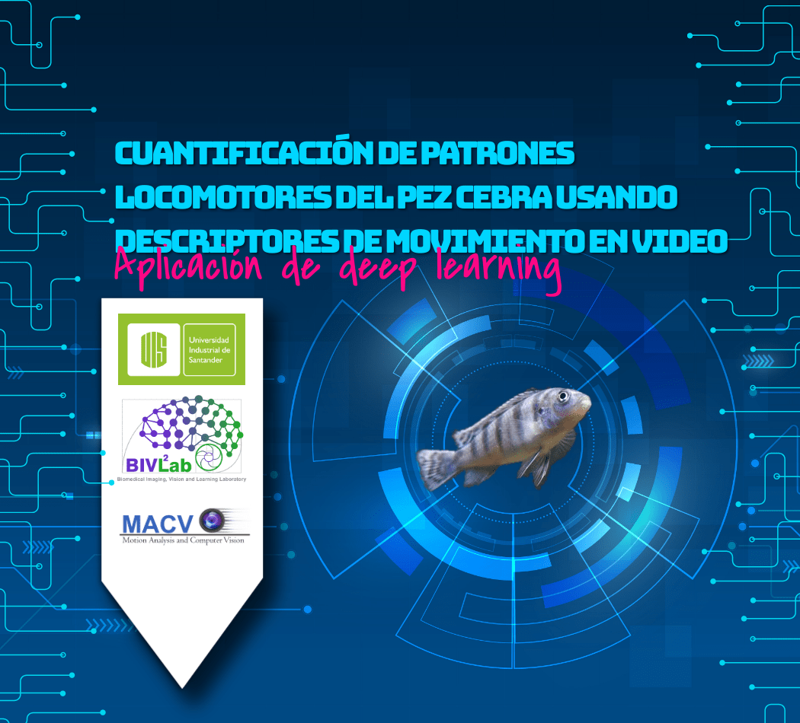

# Cuantificación de patrones locomotores del pez cebra usando descriptores de movimiento en video.

Autor: Edgar Andrés Montenegro Martínez.

## Objetivo
El objetivo de este proyecto fue la caracterización y clasificación de la conducta social del pez cebra en un experimento del comportamiento social con 
cafeína empleando redes neuronales convolucionales.

## Dataset:
El dataset utilizado consta de 110 videos de movimiento de peces cebra todos agrupados en cuatro clases de niveles de estres inducidos por 
cafeina (control, estrés0, estrés10, estrés100), todos estos videos constan de una resolución de 150x268px y a una velocidad a 30fps.

## Algoritmos utilizados:

1. Lenet-5.
2. VGG-16.
3. VGG-19.
4. Arquitecturas de 4, 6, 8 convolucionales.

 
